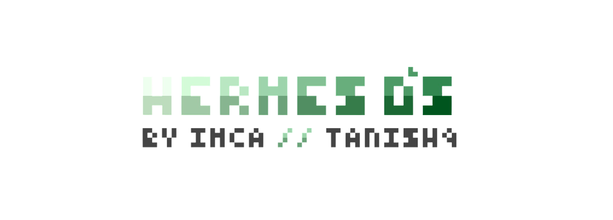

<div align="center">

# HERMES: A Desktop Environment, Reimagined as a Web App

*Not a website pretending to be an OS. An OS that happens to run in one.*

</div>

> [!CAUTION]
> PROPRIETARY AND CONFIDENTIAL
> This project, along with the associated codebase, constitutes the proprietary and strictly confidential intellectual property of its author.
> UNAUTHORIZED USE IS STRICTLY PROHIBITED. You may not copy, distribute, transmit, reproduce, publish, modify, or create derivative works from this source material without explicit, documented authorization from the chief developer.
> This repository does NOT grant an open-source license. All rights are explicitly reserved.

<p align="center">


</p>

## About This Project

Hermes is a desktop-environment shell that runs as a web application first and a native `.exe` second. It presents itself as a lightweight, glassmorphic "operating system" — a window manager, file explorer, browser, and torrent client living inside one cohesive interface — while actually being a single-page app that can be deployed to the browser (Repl.it) or packaged into a self-updating Windows executable (Electron + electron-builder). The name fits the purpose: Hermes moves things between places — files between disks, pages between tabs, updates between GitHub and the user's machine.

## Design Philosophy

**First Impression:** A dark, glassmorphic desktop with a custom wallpaper system, a taskbar, and application icons — the interface should feel like a real OS shell, not a website pretending to be one. No browser chrome bleeding through; Hermes owns every pixel.

**Performance as a Feature:** Prior attempts at window-based web UIs suffered from rubberbanding and re-render lag once more than a couple of windows were open. Hermes is built around transform-based dragging (`translate3d`, not `top`/`left`), state commits only on drag-end, and per-window memoization — so the OS metaphor doesn't fall apart the moment it's used the way a real OS is used.

**Modular Applications:** Each "app" (file explorer, browser, torrent client, settings/control center) is an isolated window component with its own state boundary, so heavy content in one window never stutters another.

## Technical Architecture

### Frontend / Shell Stack
- **React 18+** for the desktop shell, window manager, and all in-app "applications"
- **Tailwind CSS** for the glassmorphism design system (blur, translucency, custom wallpaper theming)
- **Framer Motion** used sparingly — for window open/close and taskbar transitions only, never for drag physics (drag stays on raw `transform` + `requestAnimationFrame`)
- **react-window** for virtualized file lists and any long scrollable content

### Desktop Runtime (Packaged Build)
- **Electron** as the desktop shell — Chromium + Node.js, giving full control over UI while retaining OS-level access
- **Node `fs` module** (main process) for real disk read/write, exposed to the renderer via IPC — never accessed directly from the UI thread
- **electron-builder** + **electron-updater** for packaging the `.exe` and checking Hermes's own GitHub repo for new releases, prompting the user before auto-downloading

### In-App Applications
- **File Explorer:** reads and displays the local filesystem (via IPC to `fs`) inside a Hermes-native window — not the Windows Explorer, a full reimplementation
- **Browser:** built on Electron's `<webview>`/`BrowserView`, forked from an open-source Electron browser skeleton and reskinned entirely in Hermes's own UI — tabs, address bar, and navigation all custom
- **Torrent Client:** powered by **WebTorrent**, downloading directly to disk through the same IPC bridge as the file explorer
- **Control Center:** wallpaper import/management, manual storage integrations (Google Drive and others), and auto-update preferences

### Storage Model
- Local disk is the default and primary storage — no forced database
- Cloud accounts (starting with Google Drive) are attached manually through Control Center and shown as a synced folder inside the File Explorer, not mounted as a Windows drive letter (that's a v2+ stretch goal requiring a virtual filesystem driver like WinFsp)

### Deployment
- **Repl.it**: browser-only build, always-on, redeploys automatically on push — OS-level features (raw disk access, torrenting) are disabled/hidden in this build
- **Electron `.exe`**: full-featured build with disk access, browser, and torrenting, distributed via GitHub Releases with self-checking auto-update

## User Flow

### 1. Boot
User opens Hermes (browser tab or `.exe`). A glassmorphic desktop loads with a default or last-used wallpaper, a taskbar, and app icons.

### 2. Launching Applications
Clicking an icon spawns a window — draggable, resizable, isolated in its own render tree. Multiple windows can be open simultaneously without degrading drag performance.

### 3. File Explorer
Opens onto the local disk (Electron build) via IPC-bridged `fs` calls. Any attached cloud storage appears as an additional synced location within the same explorer window.

### 4. Browser
Opens a fresh tab inside a Hermes-skinned browser window — user's own address bar, bookmarks, and controls, running on Electron's embedded Chromium.

### 5. Torrent Client
User pastes a magnet link or `.torrent` file; WebTorrent handles the transfer and writes completed files straight to the chosen disk location.

### 6. Control Center
Change wallpaper (built-in or imported), attach/detach cloud storage accounts, toggle auto-update behavior, and view app-level settings.

### 7. Updates (Electron build only)
On launch (and periodically while connected), Hermes checks its GitHub repo for new releases. If found, the user is prompted for permission before the update downloads and installs.

## Setup & Execution

### Prerequisites
- Node.js (v18+)
- Git
- npm or yarn
- GitHub repository configured for releases (for the auto-update path)

### Local Development

```bash
# Clone and install
git clone <your-repo-url>
cd hermes
npm install

# Run the browser-only build (renderer only, no Electron)
npm run dev

# Run the full desktop build (Electron + renderer)
npm run electron:dev
```

### Environment Variables

```
GOOGLE_DRIVE_CLIENT_ID=your_google_oauth_client_id
GOOGLE_DRIVE_CLIENT_SECRET=your_google_oauth_secret
GITHUB_REPO=your-username/hermes
```

### Packaging the `.exe`

```bash
npm run build
npx electron-builder --win
```

`electron-builder` reads its publish config (GitHub provider) from `package.json`, so pushing a new tagged release to `GITHUB_REPO` is enough for existing installs to detect and offer the update.

### Deploying the Browser-Only Build (Repl.it)

1. Import the repo into a new Repl.
2. Set the build command to `npm run build` and start command to `npm run start:web`.
3. Repl.it redeploys automatically on every push — no manual update flow needed for this build.

## Key Features

- **OS Metaphor, Web Speed:** Looks and behaves like a desktop environment, runs like a normal, snappy web app
- **Real Disk Access (Electron build):** File Explorer and Torrent Client both write to and read from the actual local filesystem
- **Custom Browser:** Fully reskinned Chromium-based browser embedded as a native Hermes window, not an iframe
- **Self-Updating:** Electron build checks GitHub Releases and prompts before installing updates
- **Bring-Your-Own-Storage:** Manual cloud storage attachment (starting with Google Drive) through Control Center, no forced backend database
- **Dual Deployment:** One codebase, two targets — full-featured desktop `.exe` and a lighter always-on web build

## Security & Privacy

- Google Drive (and future storage) credentials are handled via OAuth; tokens are never stored in plaintext
- Torrent activity is local to the user's machine — Hermes does not proxy, log, or relay torrent traffic
- Disk access in the Electron build is confined to explicit user-initiated actions through the File Explorer and Torrent Client — no background scanning of the filesystem

## Future Enhancements

- True drive-letter mounting for cloud storage via a virtual filesystem driver (WinFsp/Dokan)
- Additional cloud providers beyond Google Drive (Dropbox, OneDrive)
- Plugin/app system so third-party "applications" can be added to the desktop shell
- Multi-monitor / multi-desktop (virtual workspace) support
- macOS and Linux packaging alongside the Windows `.exe`
